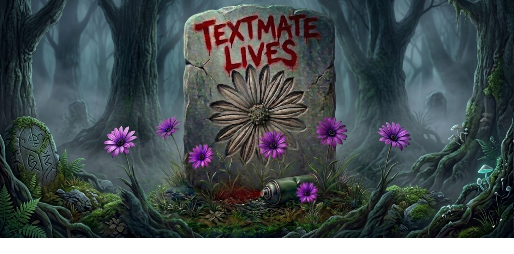
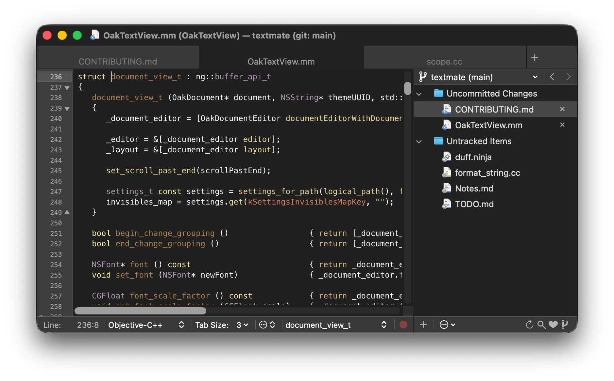

# TextMate

<p align="center">
  
</p>

## About this fork

I ❤️ TextMate.

I have been using it almost everyday since I bought it (way back in I think 2008?) and while many friends and colleagues moved on to Sublime, then Atom then VS Code etc. I stayed with TextMate. I just like TextMate. Even with its many quirks over the last few years, I stuck with it -- it is a trusted ally. I still think when it comes to editing, it has features that many folks fail to appreciate.

I have always wanted to contribute and help get it back up to speed, but to be honest, I am not much of a macOS programmer and TextMate is a fairly sophisticated app. You can probably see where this is heading: *vibe coded fixes.*

Now, I recognize that some folks may not be keen on this practice and so I make no assumptions or prognostications and I will not storm Allan Odgaard with unsolicited PRs, but I have a bunch of changes that I think could help put TM back in a great place for the other folks out there that still enjoy using it.

@sorbits if you are still out there, thank you for TextMate. I hope that this message finds you well and that you do not find the work distasteful or offensive.

Long live TextMate!

## Requirements

- Apple Silicon (arm64); Intel Macs are not supported.
- macOS 26 or later.
- System Ruby 2.6.10 (`/usr/bin/ruby`) for bundle commands. Override with `TM_RUBY` if needed.

## Download

Grab the latest signed and notarized build from the [Releases page](https://github.com/textmatelives/textmate/releases).

## Feedback

For fork-specific bugs, feature requests, and discussion, [file an issue](https://github.com/textmatelives/textmate/issues). Patches are welcome too — [open a pull request](https://github.com/textmatelives/textmate/pulls), with or without a matching issue.

For questions about TextMate proper (history, design, upstream behaviour), see the [upstream project](https://github.com/textmate/textmate).

## Screenshot

<p align="center">
  
</p>

# Building

## Setup

To build TextMate, you need the following:

 * [boost][]         — portable C++ source libraries
 * [multimarkdown][] — marked-up plain text compiler
 * [ninja][]         — build system similar to `make`
 * [ragel][]         — state machine compiler
 * [sparsehash][]    — a cache friendly `hash_map`

All this can be installed using either [Homebrew][] or [MacPorts][]:

```sh
# Homebrew
brew install boost google-sparsehash multimarkdown ninja ragel

# MacPorts
sudo port install boost multimarkdown ninja ragel sparsehash
```

After installing dependencies, make sure you have a full checkout (including submodules) and then run `./configure` followed by `ninja`, for example:

```sh
git clone --recursive https://github.com/textmatelives/textmate.git
cd textmate
./configure && ninja TextMate/run
```

The `./configure` script simply checks that all dependencies can be found, and then calls `bin/rave` to bootstrap a `build.ninja` file with default config set to `release` and default target set to `TextMate`.

## Building from within TextMate

You should install the [Ninja][NinjaBundle] bundle which can be installed via _Preferences_ → _Bundles_.

After this you can press ⌘B to build from within TextMate. In case you haven't already you also need to set up the `PATH` variable either in _Preferences_ → _Variables_ or `~/.tm_properties` so it can find `ninja` and related tools; an example could be `$PATH:/opt/homebrew/bin`.

The default target (set in `.tm_properties`) is `TextMate/run`. This will relaunch TextMate but when called from within TextMate, a dialog will appear before the current instance is killed. As there is full session restore, it is safe to relaunch even with unsaved changes.

If the current file is a test file then the target to build is changed to build the library to which the test belongs (this is done by setting `TM_NINJA_TARGET` in the `.tm_properties` file found in the root of the source tree).

Similarly, if the current file belongs to an application target (other than `TextMate.app`) then `TM_NINJA_TARGET` is set to build and run this application.

## Build Targets

For the `TextMate.app` application there are two symbolic build targets:

```sh
ninja TextMate      # Build and sign TextMate
ninja TextMate/run  # Build, sign, and (re)launch TextMate
```

To clean everything run:

```sh
ninja -t clean
```

Or simply delete `~/build/TextMate`.

# Legal

The source for TextMate is released under the GNU General Public License as published by the Free Software Foundation, either version 3 of the License, or (at your option) any later version.

TextMate is a trademark of Allan Odgaard.

[boost]:         http://www.boost.org/
[ninja]:         https://ninja-build.org/
[multimarkdown]: http://fletcherpenney.net/multimarkdown/
[ragel]:         http://www.complang.org/ragel/
[MacPorts]:      http://www.macports.org/
[Homebrew]:      http://brew.sh/
[NinjaBundle]:   https://github.com/textmate/ninja.tmbundle
[sparsehash]:    https://code.google.com/p/sparsehash/
